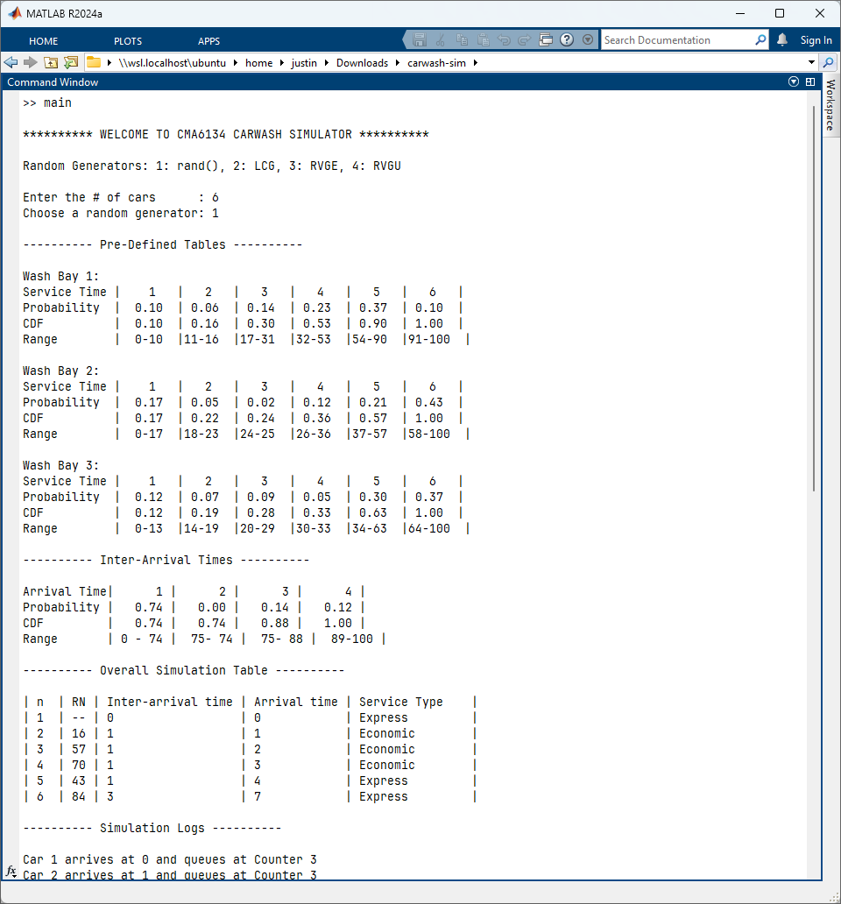

# carwash-sim

This is a carwash simulator for CMA6134 Assignment 1.

For testing LCG, try parameters: 1, 5, 7

## Report

- Cover Page
- Introduction
- Simulation Details
  - Flowcharts
  - Source Codes
  - Formulas
  - Explanations
- Simulation Results
- Evaluation Results
- Conclusion

## Queue Simulator

- 3 wash bay
- Single line and then proceed to 'A' wash bay
- Service type is random
- Generate table service time (wash bay)
- Inter-arrival time (car)
